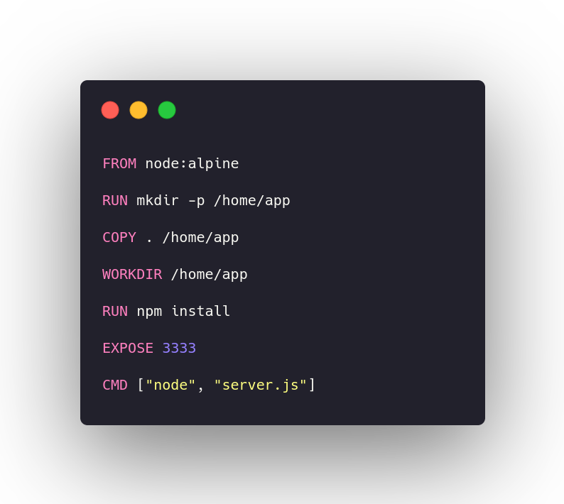
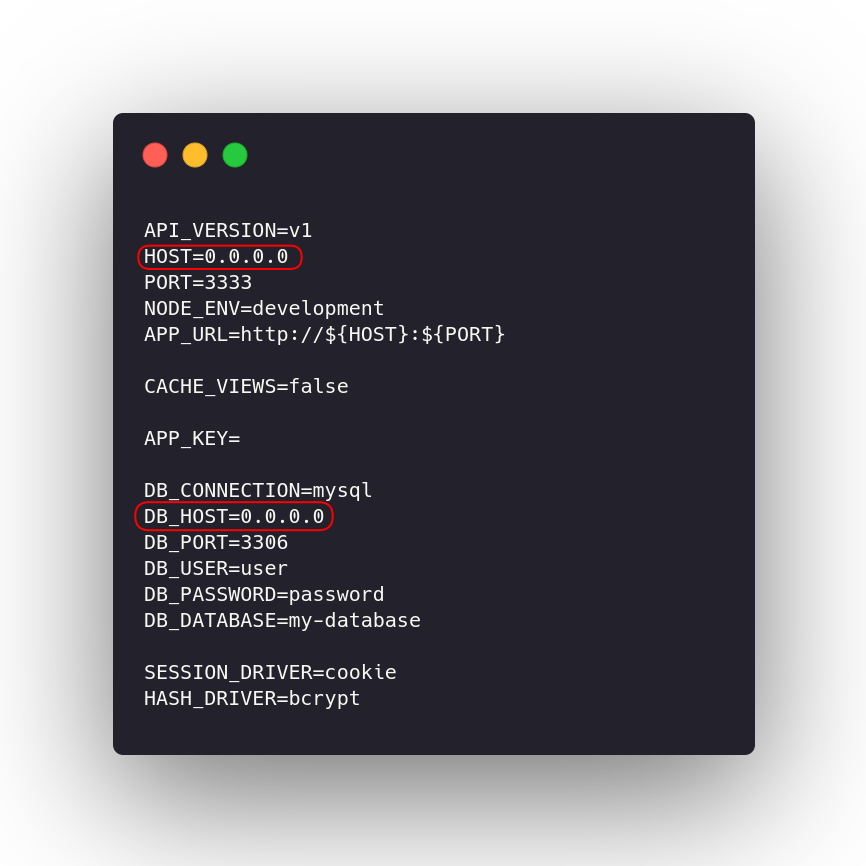
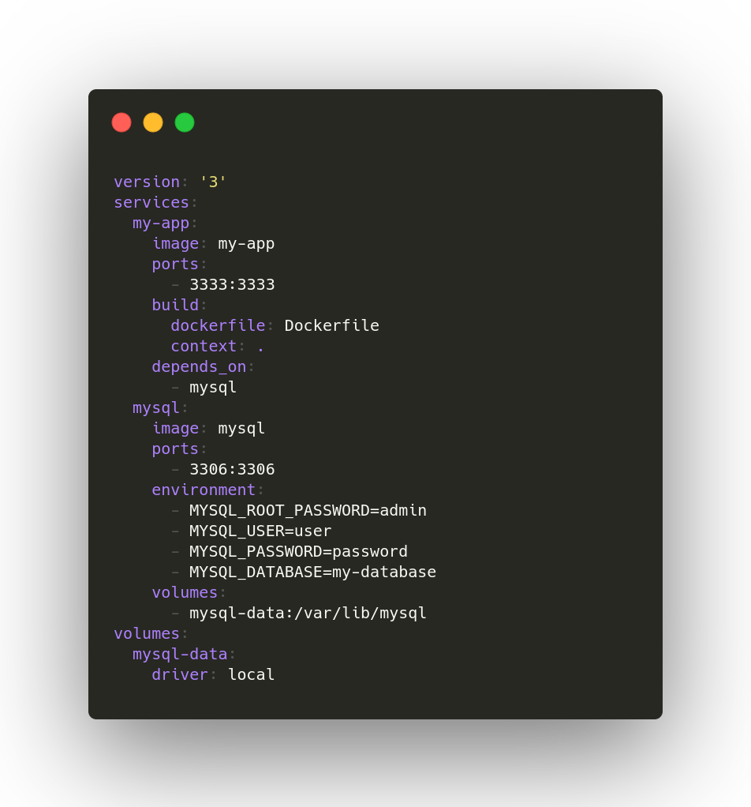
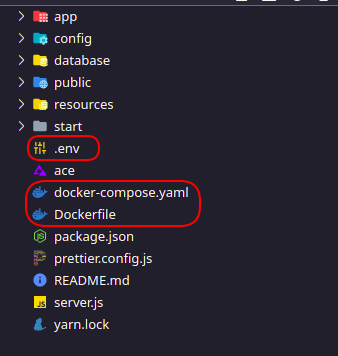
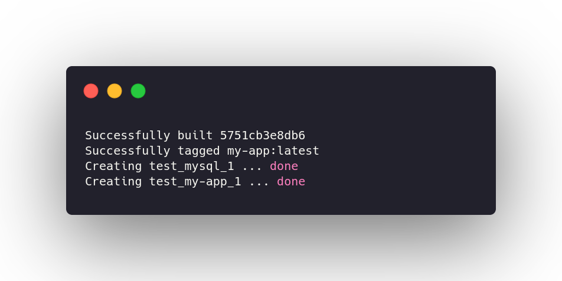

# Ambiente de teste local utilizando Docker
Essa pasta contém um exemplo simples de uma aplicação desenvolvida em **Node.js** que utiliza **MySQL**. 

Esse README será bem direto ao ponto. Para uma introdução e uma explicação mais detalhada, consulte o [tutorial de Docker](../docker-tutorial).

## Requisitos
- [Docker](https://docs.docker.com/get-docker/)
- [docker-compose](https://docs.docker.com/compose/install/)

## Instalação no Linux (opcional)
### Ubuntu/Debian
```
# Docker 
curl -fsSL https://get.docker.com -o get-docker.sh
sudo sh get-docker.sh
sudo usermod -aG docker $USER
sudo reboot

# docker-compose
sudo curl -L "https://github.com/docker/compose/releases/download/1.28.2/docker-compose-$(uname -s)-$(uname -m)" -o /usr/local/bin/docker-compose
sudo chmod +x /usr/local/bin/docker-compose
```
### Manjaro
```
sudo pacman -Syu docker docker-compose 
sudo systemctl enable docker
sudo systemctl start docker
sudo usermod -aG docker $USER
sudo reboot
```
### Post-install
Se quiser verificar sua instalação:
```
docker version
```
Se quiser rodar um pequeno teste local:
```
docker run hello-world
```
## Arquivos e configurações

### 1) Dockerfile
A **Dockerfile** por default recebe esse nome e fica localizada na raiz do diretório do projeto. 

É possível alterar esse padrão, mas por questão de praticidade, recomenda-se manter essa estrutura.

A [Dockerfile desse repositório](./Dockerfile) é bem simples, conforme a imagem abaixo:

<p align="center">
  
</p>

### 2) .env
É bem importante que as variáveis HOST e DB_HOST definidas na sua **.env** sejam **0.0.0.0**, conforme a [.env.example desse repositório](./.env.example).

<p align="center">
  
</p>

As demais opções podem ser customizadas de acordo com seu projeto. Porém, se alterar algo relacionado ao container do banco de dados **lembre-se de realizar essas alterações no arquivo docker-compose.yaml**.

### 3) docker-compose-yaml

O arquivo [docker-compose.yaml desse repositório](./docker-compose.yaml) fornece um setup básico para funcionamento de um app **Node.js** que utiliza um banco de dados **MySQL**.

<p align="center">
  
</p>

Se você tiver alguma dúvida sobre variáveis de ambiente, volumes, releases disponíveis para uma imagem (ex: outra versão do banco de dados), tudo isso é bem documentado no [docker.hub](https://hub.docker.com/) para as principais imagens.

## Execução

Garanta que os três arquivos desse diretório estão na raiz do seu projeto. Exemplo:

<p align="center">
  
</p>

Para subir todo o ambiente basta utilizar um comando:
```
docker-compose up -d --build
```

Se tudo der certo, provavelmente você verá uma mensagem do tipo:

<p align="center">
  
</p>

Para o nosso exemplo, o app estará visível em

> http://localhost:3333

Para parar e remover todos os recursos criados:
```
docker-compose down --rmi all -v
```

---

## Veja também

Como eu falei, o objetivo desse README era ser bem enxuto e direto ao ponto. Outros materiais que podem ser úteis:

- [Troubleshooting e debug de containers](./other/README-troubleshooting.md)
- [Outras opções de execução com docker-compose](./other/README-opcoes.md)
- [Exemplo com MongoDB](./other/README-mongo.md)
- [Tutorial de Docker](../docker-tutorial) (em desenvolvimento)