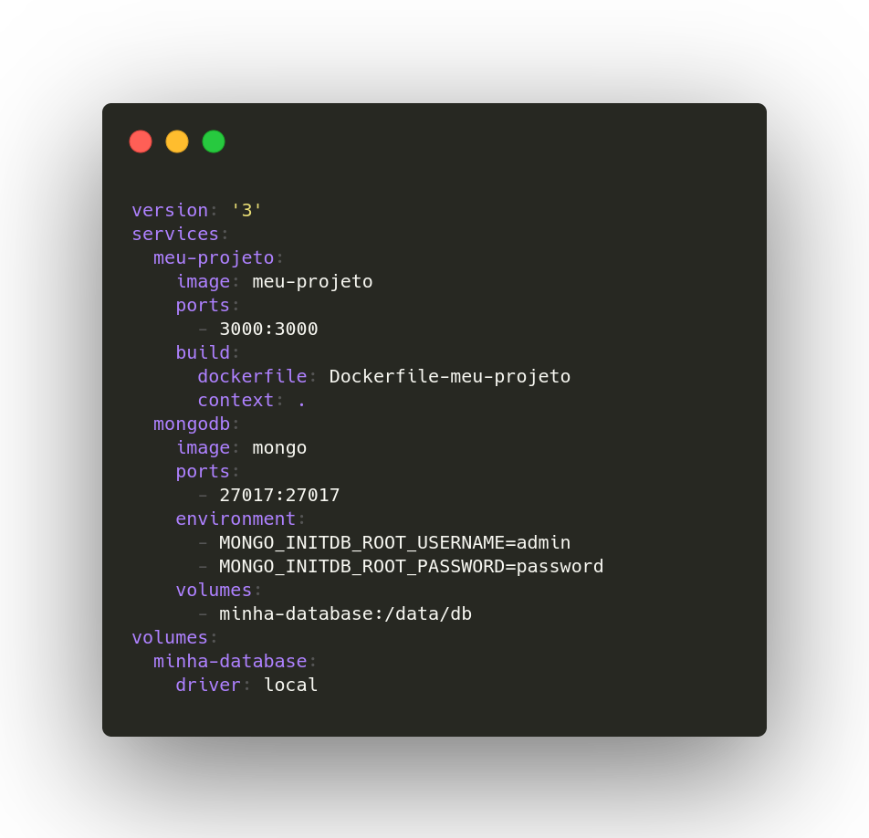
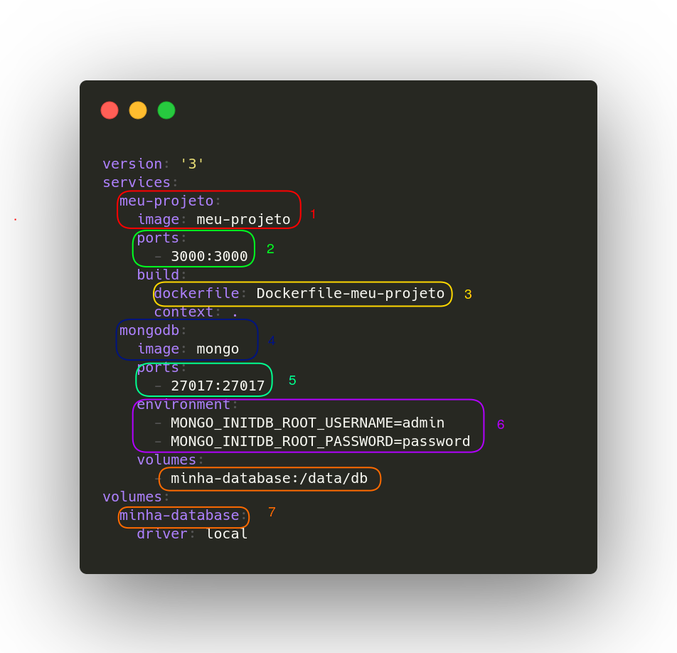
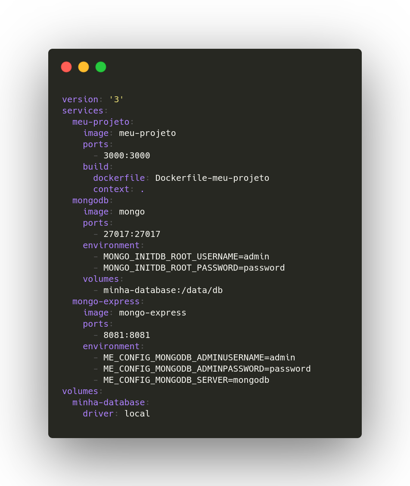

## Exemplo de docker-compose.yaml com MongoDB

Um exemplo alternativo ao apresentado anteriormente para ilustrar quais alterações devem ser feitas para se utilizar outro banco de dados.

  

Alterações comparadas com [exemplo anterior](../README.md):

1) Nome do container e imagem
2) Porta utilizada
3) Nome da Dockerfile
4) Imagem do banco de dados
5) Path do volume montado (varia para cada banco de dados)
6) Variáveis de ambiente 
7) Nome do volume montado

  

## Exemplo adicionando a UI do MongoExpress

É possível adicionar mais quantos containers você desejar no seu **docker-compose.yaml**. Nesse exemplo adicionamos a UI do MongoDB, o MongoExpress.

A sintaxe é a mesma, apenas é adicionado mais um container. 

As variáveis de ambiente irão depender da imagem que você está utilizando.

  

Nesse exemplo temos nosso app na porta **3000** e a UI do MongoExpress na porta **8081**.

> http://localhost:3000  
> http://localhost:8081
