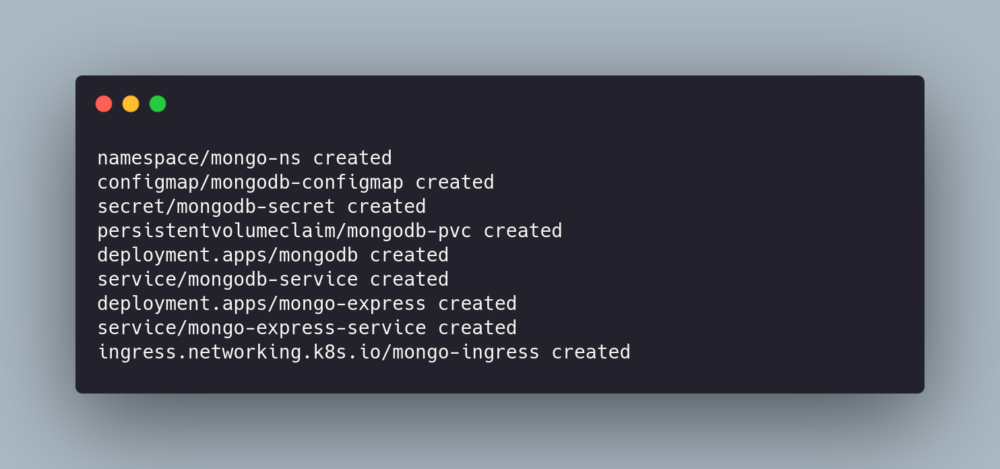

## Requisitos

- [aws cli](https://github.com/aws/aws-cli)
- ~~[terraform](https://github.com/hashicorp/terraform)~~
- [jq](https://github.com/stedolan/jq)
- [kOps](https://github.com/kubernetes/kops)
- [kubectl](https://github.com/kubernetes/kubectl)
- [dnsutils](https://packages.debian.org/jessie/dnsutils)
- [direnv](https://direnv.net/)

## Recursos utilizados

- Route 53
- S3
- EC2

*Obs: VPC, subnets, security groups e outros recursos gratuitos da AWS serão criados e consumidos pelo kOps.

## Passo a passo
### **1) Download**

Clone esse repo e dê permissão de execução para todos os arquivos **.sh** e para o arquivo **.py**
```
git clone git@github.com:lubysoftware/k8s-aws-create.git && \
find ./k8s-aws-create -type f \( -name "*.sh" -o -name "*.py" \) -exec chmod +x {} \;
```
*Obs: o comando anterior é a mesma coisa que fazer **chmod +x** para todos os arquivos com extensão **.sh** e **.py**

Execute o comando a seguir, substituindo **seu.dominio.com** por um domínio real.
```
sed 's/luby.ml/seu.dominio.com/' k8s-aws-create/.envrc
```
Entre no diretório, dê permissão para o **direnv** e carregue as variáveis de ambiente
```
cd kops-aws-create/ && \
direnv allow . && \
direnv reload
```

### **2) AWS CLI**
É necessário instalar a linha de comando da AWS e configurar um usuário com uma access key válida. Conforme esse [link](https://docs.aws.amazon.com/cli/latest/userguide/cli-configure-quickstart.html).

### **3) Usuário IAM (opcional)**
Caso não queira utilizar seu usuário IAM com todas as permissões de admin, pode-se criar um usuário apenas com as permissões necessárias para gerenciar o cluster. Basta executar o script **new-user.sh**

```
./init/setup-new-user.sh
```
Se quiser testar a configuração do **direnv**, verifique se o novo usuário foi exportado para o seu shell atual.
```
echo $AWS_PROFILE
```
### **4) Configurar DNS**
Aqui, começa de fato o deploy utilizando o kOps. 

Existem algumas opções relacionadas à configuração do domínio que servirá para o cluster. Todas elas estão bem explicadas nesse [tutorial](https://github.com/kubernetes/kops/blob/master/docs/getting_started/aws.md).

Mesmo utilizando um domínio externo, **todas opções irão passar pelo Route 53** da Amazon.

Eu peguei um domínio gratuito no [freenom.com](https://www.freenom.com/) para um setup de testes. Mas pode ser configurado algum subdomínio de um domínio já registrado (exemplo: *k8s.luby.com.br* ou *cluster.luby.com.br* caso seu domínio seja *luby.com.br*).

Se quiser testar a configuração do **direnv**, verifique se seu domínio foi exportado para o seu shell atual.
```
echo $DOMAIN
```
Em seguida, utilize o comando para criar uma zona hospedad no Route 53.
```
ID=$(uuidgen) && aws route53 create-hosted-zone --name ${DOMAIN} --caller-reference $ID | jq .DelegationSet.NameServers
```
O output será um json parecido com isso

> {</br>
>   "ns-947.awsdns-54.net" </br>
>   "ns-423.awsdns-52.com" </br>
>   "ns-1893.awsdns-44.co.uk" </br>
>   "ns-1076.awsdns-06.org" </br>
> }
---
<p align="center">
  </br>
  É preciso ir até onde você registrou esse domínio para configurar os name servers criados pela Amazon. </br>
  </br>
  Isso irá variar de acordo com seu provedor. </br>
  </br>
<b>Não prossiga</b> sem ter certeza que esse passo foi configurado de forma correta. Caso contrário, não irá funcionar.</br>
</br>
A mudança pode demorar até 24h, mas geralmente entre 30min e 2h é suficiente.
</p>

---

É possível checar com o comando.

```
 dig ns ${DOMAIN} +short
```
### **5) Setup cluster**
Se todas as variáveis de ambiente e acessos à AWS estiverem funcionando corretamente, o script **setup-cluster.sh** irá configurar todas as etapas dentro desse item 5.
```
./init/setup-cluster.sh
```
O passo a passo está explicado a seguir.
#### **5.1) Bucket S3**
O kOps utiliza um bucket para armazenar o estado do cluster (parecido com o que o terraform faz).

Portanto é necessário criar um bucket para isso.
```
aws s3 mb ${BUCKET_PATH}
```
A [documentação oficial](https://github.com/kubernetes/kops/blob/master/docs/getting_started/aws.md) do kOps recomenda que o versionamento de bucket seja ativado.
```
aws s3api put-bucket-versioning --bucket ${BUCKET_NAME} --versioning-configuration Status=Enabled
```
#### **5.2) Criar cluster**
O kOps oferece diversas configurações out-of-the-box que podem ser passadas diretamente via linha de comando.

Para ver todas as opções, recomenda-se:
```
kops create cluster --help
```
Inclusive, a opção **--output yaml** permite a geração de um arquivo YAML com as configurações atuais. Isso é muito bom e prático em termos de IaC.

Eu utilizo essa opção junto com **--dry-run** para gerar o arquivo YAML antes de aplicar as configurações ao cluster.

Lembre-se de redirecionar o *standard output* para um arquivo utilizando o operador **> arquivo.yaml**
```
kops create cluster \
--cloud aws \
--name ${DOMAIN} \
--container-runtime containerd \
--zones us-east-1a,us-east-1b,us-east-1c \
--master-size t2.micro \
--master-volume-size 30 \
--master-count 1 \
--master-zones us-east-1a \
--node-size t2.micro \
--node-volume-size 30 \
--node-count 3 \
--dry-run \
--output yaml > cluster.yaml
```
Para criar um cluster a partir de um arquivo YAML, utilize o comando abaixo.
```
kops create -f cluster.yaml
```
<p align="center">
  
</p>

#### **5.3) Chave SSH**
Provavelmente você verá uma mensagem do tipo:
>SSH public key must be specified when running with AWS

Antes de proceder com o deploy do cluster utilize o comando abaixo.
```
kops create secret --name ${DOMAIN} sshpublickey admin -i ~/.ssh/id_rsa.pub
```
Caso não tenha uma chave ssh do tipo rsa configurada na sua máquina local, utilize o comando abaixo. 

```
ssh-keygen -t rsa -C "${EMAIL_SSH}"
```
Volte e execute "**kops create secret...**".
#### **5.4) Deploy cluster**
Para aplicar as configurações criadas utilize:
```
kops update cluster --name ${DOMAIN} --yes --admin=87600h
```
Você verá uma mensagem parecida com essa.
<p align="center">
  
</p>

## Pós instalação
O comando a seguinte acessa apenas o bucket, é uma verificação primária, mas é um bom ponto de partida.
```
kops get cluster
```
Esse comando é um health check mais completo. De fato irá dizer se o cluster está pronto ou não.
```
kops validate cluster
```

O **kubectl** é configurado automaticamente na sua máquina local. Seu cluster deve ser acessível por ele.
```
kubectl cluster-info
```
E também
```
kubectl get nodes
```
## Editar configurações/update

Se quiser editar alguma configuração ou fazer algum update, é recomendável **editar o arquivo YAML**. Mantendo suas mudanças documentadas e boas práticas de IaC.
```
kops get cluster -o yaml > cluster.yaml
```
Após a edição
```
kops replace -f cluster.yaml
```
Para aplicar as mudanças
```
kops update cluster $DOMAIN --yes
```
Outras opções como upgrade na versão do Kuberntes, rolling update, etc. estão bem documentadas [nesse link](https://kops.sigs.k8s.io/operations/updates_and_upgrades/).

## NGINX Ingress Controller
Utilize o comando abaixo. 
```
kubectl apply -f https://raw.githubusercontent.com/kubernetes/ingress-nginx/controller-v0.43.0/deploy/static/provider/aws/deploy.yaml
```
*Obs: Será provisionado um **Network Load Balancer na AWS**.

Para ver o DNS configurado pelo Amazon ELB:
```
kubectl get all -n ingress-nginx
```
<p align="center">
  
</p>

Pegue esse DNS, vá até a sua zona hospedada no Route 53 e escolha a opção "Criar registro". Crie um registro com as seguintes configurações:

- **Política de roteamento**: Rastreamento Simples
- **Nome do registro**: *
- **Tipo de registro**: CNAME
- **Valor**: insira_aqui_seu_dns

Deixe o nome do registro como * para ser um DNS wildcard. Ou seja, irá dar match com qualquer configuração de subdomínio:

- app-cliente-1.luby.com.br
- database-cliente-1.luby.com.br
- novo-ecomerce.luby.com.br
- teste.luby.com.br

<p align="center">
  
</p>

## Storage class

Na pasta **yaml-manifests** existe um manifest para declarar uma storage class utilizando o Elastic Block Storage da Amazon.
```
apiVersion: storage.k8s.io/v1
kind: StorageClass
metadata:
  name: default-storage-class
provisioner: kubernetes.io/aws-ebs
parameters:
  type: gp2
  fsType: ext4
reclaimPolicy: Delete
allowVolumeExpansion: true
mountOptions:
  - debug
volumeBindingMode: Immediate
```
Para criar o recurso, basta utilizar:
```
kubectl apply -f ./yaml-manifests/storage-class.yaml
```

## Deploy de teste: MongoDB

O arquivo **mongo-config.yaml** dentro da pasta **yaml-manifests** irá realizar o deploy de:

1) MongoDB
2) Mongo Express

Que é um bom exemplo pois simula uma aplicação web que utiliza um banco de dados. Pra isso, será provisionado:

- 1x Namespace
- 1x Secret
- 1x ConfigMap
- 1x PersistentVolumeClaim
- 2x Deployments
- 2x Services
- 1x Ingress

```
kubectl apply -f ./yaml-manifests/mongo-config.yaml
```
<p align="center">
  
</p>

Uma representação simplificada da arquitetura desse projeto seria:
<p align="center">
  
</p>

Observe que um **pod** é o menor objeto dentro do Kubernetes. Nesse exemplo, cada pod corresponde a um container.
<p align="center">
  
</p>

Note que nós não interagimos com todos os componentes do Kubernetes. O que foi criado e que nós podemos alterar são os componentes na **cor verde**:
<p align="center">
  
</p>

---

O objetivo desse README não é ser um tutorial de Kubernetes, mas é válido ressaltar que:

1) Existem outros componentes no cluster que foram omitidos dos esquemas por motivos didáticos.
2) O NGINX tem seu próprio namespace, service, pod, deployment. Foi representado de uma maneira simplicada.
3) A StorageClass e os PersistentVolumes devem ficar no namespace default.
4) Porém, o PersistentVolumeClaim deve ser alocado no mesmo namespace da pod que irá utilizá-lo. 

---


## Bugfixes conhecidos

Coloque dentro de **spec** no seu arquivo **cluster.yaml**
```
  additionalPolicies:
    master: |
      [
        {
          "Effect": "Allow",
          "Action": "iam:CreateServiceLinkedRole",
          "Resource": "arn:aws:iam::*:role/aws-service-role/*"
         },
         {
           "Effect": "Allow",
           "Action": [
             "ec2:DescribeAccountAttributes",
             "ec2:DescribeInternetGateways"
            ],
           "Resource": "*"
         }
      ]
```

---

No caso de erros do tipo:
> The connection to the server localhost:8080 was refused - did you specify the right host or port?

ou

>W0129 13:54:37.089582   34832 root.go:251] no context set in kubecfg

Utilize:
```
kops get clusters && kops export kubecfg --name ${DOMAIN}
```

## Certificados SSL/TLS

Para instalação do [cert-manager](https://cert-manager.io/docs/installation/kubernetes/) e deploy de todos os recursos necessários:

```
kubectl apply -f https://github.com/jetstack/cert-manager/releases/download/v1.1.0/cert-manager.yaml
```